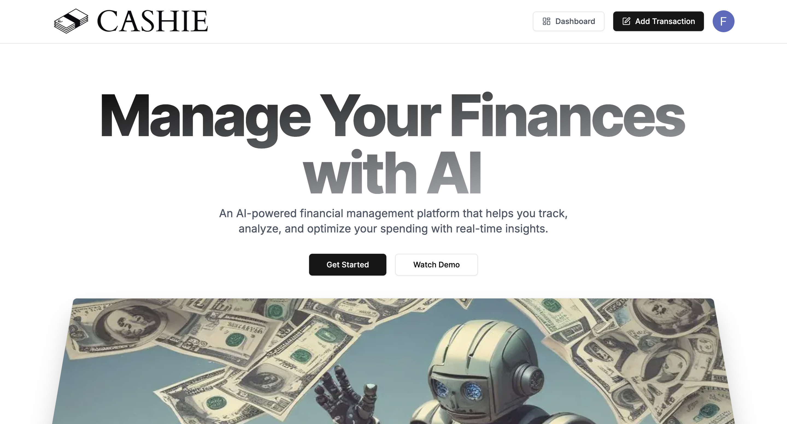
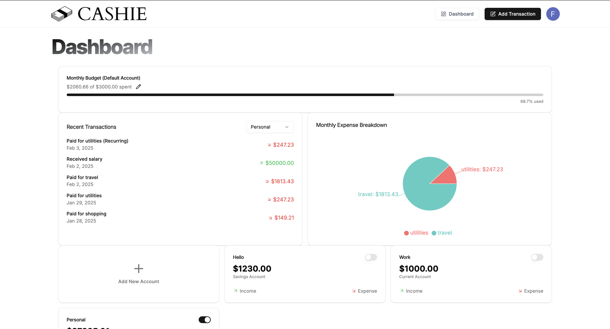
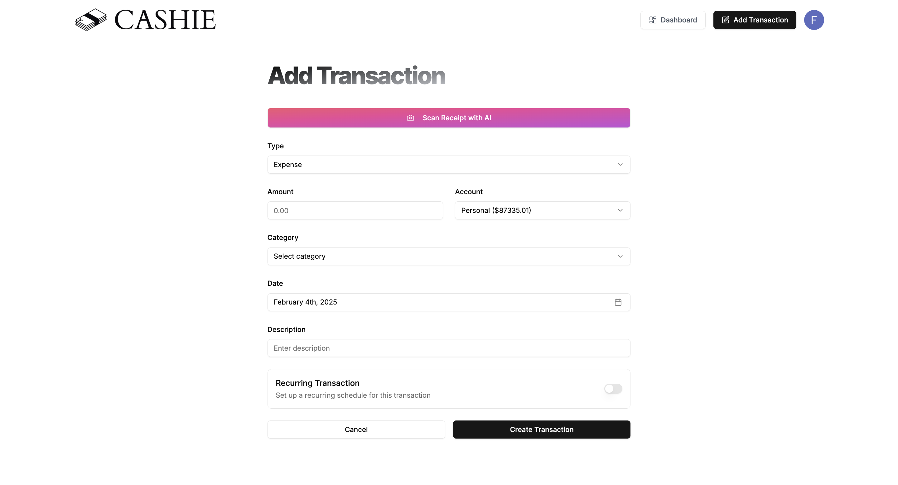
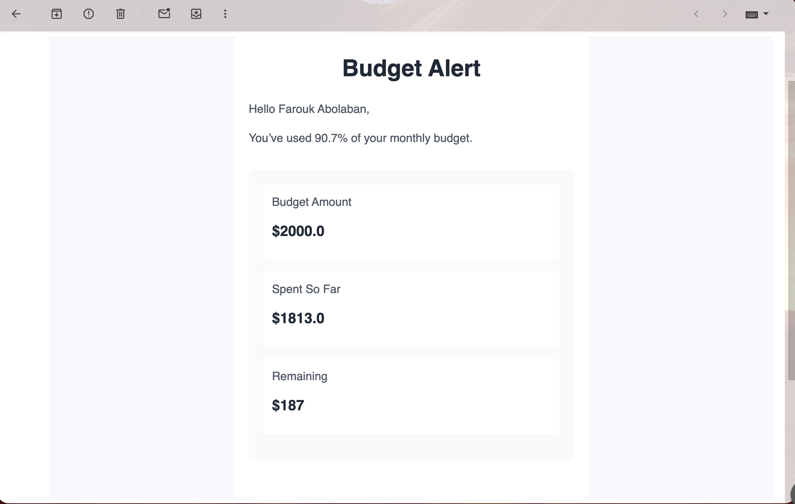
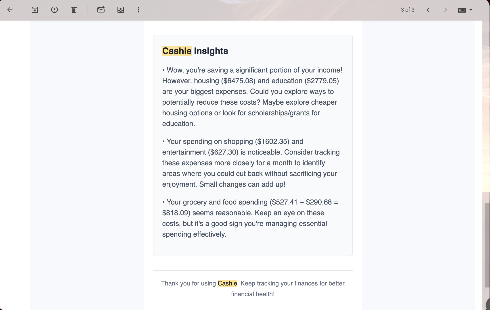

# 🏦 Cashie

**App is deployed here:** [Cashie](https://cashie-rvr1.vercel.app/)

**AI-Powered Finance Tracker & Advisor**  

Cashie is an AI-driven finance platform that helps you track your income and expenses while providing personalized financial advice. It includes features like automatic receipt scanning, budget alerts, and monthly AI-driven financial insights.  

## 🚀 Features  

- 📸 **AI Receipt Scanner** – Upload receipts, and Cashie will automatically extract transaction details.  
- 📊 **Budget Alerts** – Get notified when you're close to exceeding your budget.  
- 🧠 **AI Financial Advisor** – Receive monthly AI-generated insights on saving and optimizing expenses.  

## 🛠 Tech Stack  

- **Frontend:** [Next.js](https://nextjs.org/) + [Tailwind CSS](https://tailwindcss.com/) + [Shadcn UI](https://ui.shadcn.com/)  
- **Backend:** [Supabase](https://supabase.com/) + [Prisma](https://www.prisma.io/) + [ArcJet](https://arcjet.com/)  
- **Event Handling:** [Inngest](https://www.inngest.com/)  

## 📸 Screenshots  

### Homescreen 


### Dashboard View  


### Add a transaction + AI Receipt Scanner


### Budget Alert Email  


### Monthly Recap AI Insights



## 🏗 Installation & Setup  

### Prerequisites  

Ensure you have the following installed:  

- [Node.js](https://nodejs.org/) (LTS recommended)  
- [npm](https://www.npmjs.com/) or [yarn](https://yarnpkg.com/)  
- [Supabase CLI](https://supabase.com/docs/guides/cli) (for local database setup, if needed)  

### 1️⃣ Clone the Repository  

```bash
git clone https://github.com/yourusername/cashie.git
cd cashie
```

### 2️⃣ **Install Dependencies**

Using npm: 
```bash
npm install
```

Or using yarn: 
```bash
yarn install
```

### 3️⃣ Set Up Environment Variables

Create a .env.local file in the root directory and add your environment variables for Supabase, Prisma, Inngest, and ArcJet. Example:

```plaintext
NEXT_PUBLIC_SUPABASE_URL=your_supabase_url
NEXT_PUBLIC_SUPABASE_ANON_KEY=your_anon_key
DATABASE_URL=your_database_url
INNGEST_EVENT_KEY=your_inngest_event_key
ARCJET_API_KEY=your_arcjet_api_key
```
(Update these with your actual keys)

### 4️⃣ Set Up Prisma

```bash
npx prisma generate
npx prisma migrate dev --name init
```

### 5️⃣ Start the Development Server

```bash
npm run dev
```
or 
```bash
yarn dev
```
Your app should now be running at http://localhost:3000.

### 🔁 Running Inngest Locally

To run Inngest’s local development server:

1. Install Inngest CLI (if not already installed):
```bash
npm install -g inngest
```
2. Start the Inngest Dev Server:
```bash
inngest dev
```
3. Ensure your event handlers are correctly registered and running in your Next.js API routes. 

## 💡 Usage

1. Upload a receipt 📸 → AI scans and fills out transactions automatically.
   
2. Set a budget 📊 → Get alerts when you’re close to reaching your limit.

3. View AI-generated monthly analysis 🧠 → Get recommendations to save more.

## 🔮 Future Features

* 🏦 Bank Integration – Sync transactions directly from your bank.
  
* 📊 Custom Reports – Generate detailed financial reports.
  
* 📅 Automated Bill Reminders – Never miss a due date again.

## 🙌 Contributors

* Farouk Abolaban - [Github](https://github.com/Farouk-Abolaban)
  


